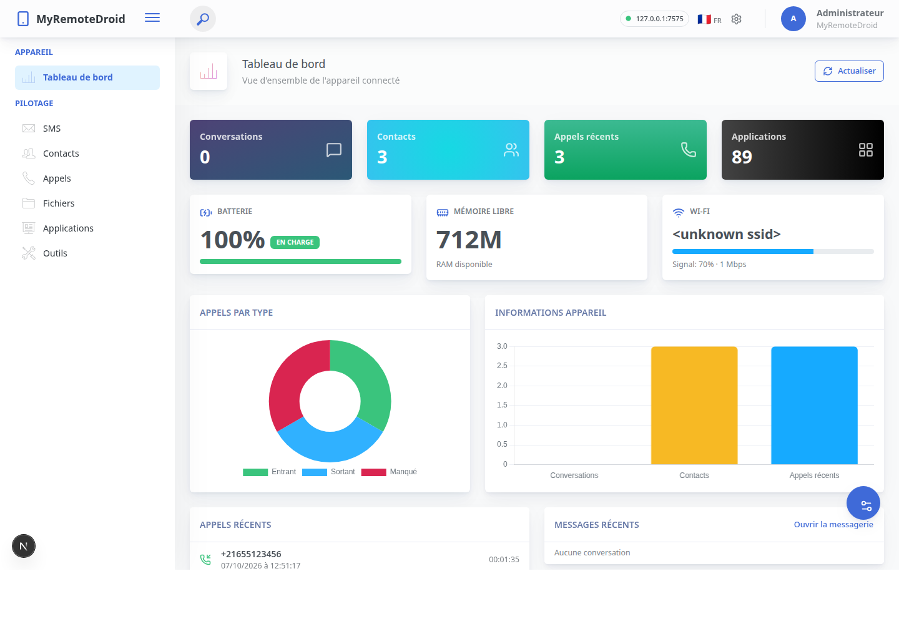

# MyRemoteDroid — Console web

Interface web moderne (Next.js + React) pour piloter un téléphone Android à
distance, construite sur le thème d'administration **ArchitectUI (Bootstrap 5)**.



## Architecture

```
Navigateur ──> Next.js (ce projet, sur le PC) ──Wi-Fi──> Téléphone (APK)
               • UI React (ArchitectUI / Bootstrap 5)     • Serveur PAW natif
               • Routes API (/api/*) = backend             • API JSON du matériel
                 s'authentifie au téléphone (PIN)            (SMS, contacts, caméra…)
```

Le navigateur ne parle jamais directement au téléphone : il appelle les **routes
API Next.js** (`/api/phone/...`), qui se connectent au téléphone avec le code PIN
(login → cookie de session) et relaient les requêtes. Le code qui accède au
matériel (SMS, caméra, micro, contacts…) **reste natif sur le téléphone** — c'est
une contrainte Android, Node.js ne peut pas y accéder.

## Fonctionnalités

- **Tableau de bord** — batterie, mémoire libre, Wi-Fi/SSID en direct, compteurs
  (conversations, contacts, appels, applications), graphiques Chart.js (répartition
  des appels, volumes), appels & messages récents, actions rapides.
- **SMS** — liste des conversations, fil de discussion, envoi de messages.
- **Contacts** — liste, recherche, ajout.
- **Journal d'appels** — entrants / sortants / manqués, suppression.
- **Fichiers** — exploration, **téléversement**, **nouveau dossier**, **renommer**,
  **supprimer**, aperçu des images, téléchargement.
- **Applications** — liste des applis installées, recherche, téléchargement de l'APK.
- **Outils** — synthèse vocale, caméra (photo), enregistrement vidéo, microphone,
  fond d'écran, envoi d'e-mail (SMTP).
- **Thème** — mode clair/sombre, en-tête & menu fixes/repliables, schémas de
  couleurs ArchitectUI (panneau d'options), mémorisés dans le navigateur.
- **Multilingue** — français / anglais, commutable à chaud.

## Démarrer

Prérequis : **Node.js 20+**.

```bash
npm install
npm run dev     # développement, http://localhost:3000
# ou, en production :
npm run build && npm start
```

Côté téléphone : installer l'APK (`../app/build/outputs/apk/debug/app-debug.apk`),
lancer le serveur dans l'app — l'**adresse IP** et le **code de connexion (PIN)**
s'affichent à l'écran. Le PC et le téléphone doivent être sur le même Wi-Fi.

Au premier lancement, l'interface demande l'IP, le port (7575) et le PIN. La
configuration est enregistrée dans `.phone-config.json` (non versionné). On peut
aussi la pré-remplir par variables d'environnement : `PHONE_HOST`, `PHONE_PORT`,
`PHONE_PIN`.

## Structure

```
app/
  layout.tsx                     racine : charge le thème ArchitectUI + providers
  page.tsx                       tableau de bord
  sms|contacts|calls|files|apps|tools/page.tsx
  api/
    config/route.ts              lecture/écriture config + test de connexion
    dashboard/route.ts           agrégateur (statut appareil + compteurs)
    phone/[...path]/route.ts     proxy authentifié générique vers le téléphone
components/
  providers/AppProvider.tsx      thème, langue, toasts, état de connexion
  layout/                        AppShell, Header, Sidebar, Footer, PageTitle, ThemeDrawer
  dashboard/DashboardView.tsx    widgets + graphiques
  panels/*.tsx                   SMS, Contacts, Appels, Fichiers, Applications, Outils
  SettingsModal.tsx, ui.tsx      modale de connexion + primitives (toasts, modal…)
lib/
  phone.ts                       login PIN + cookie + phoneFetch (login mutualisé)
  api.ts                         helpers côté client
  i18n.ts                        dictionnaires FR / EN
public/architectui/              thème ArchitectUI compilé (CSS + polices d'icônes)
```

## Thème ArchitectUI

Le thème est utilisé via sa **feuille de style compilée** (`public/architectui/
assets/styles/main.css`, chargée dans `app/layout.tsx`), ce qui garantit un rendu
fidèle et un build sans erreur. La mise en page (sidebar, en-tête, cartes, widgets,
icônes Pe7 / Font Awesome) est reconstruite en composants React ; `app/globals.scss`
ajoute le mode sombre, les toasts, les modales et les animations.
